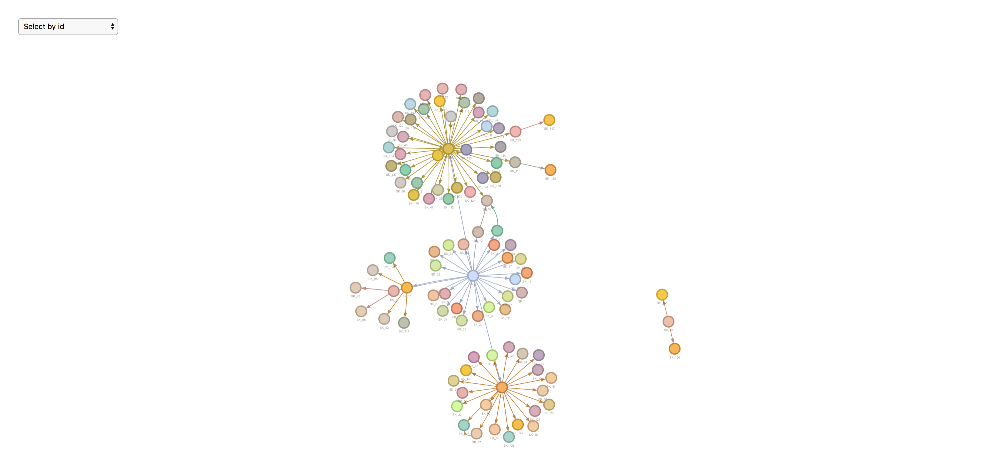
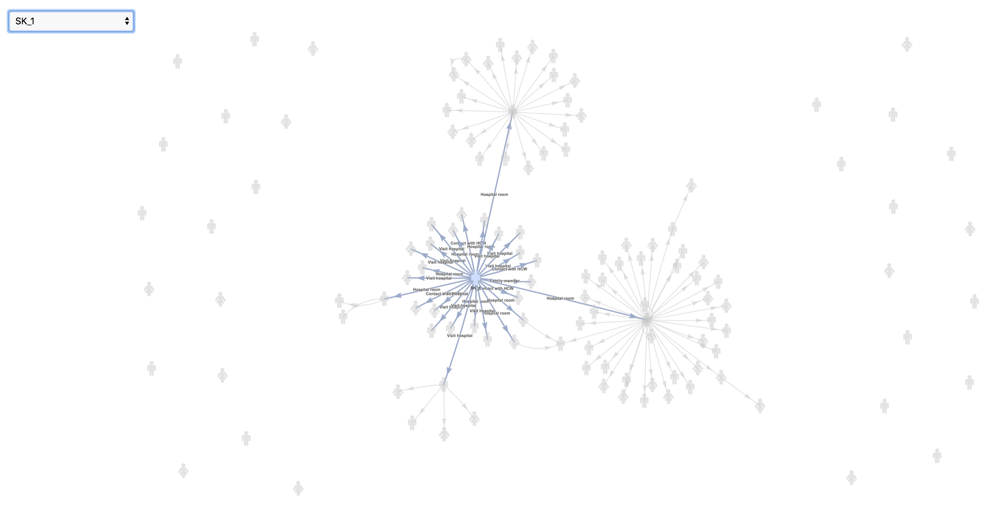
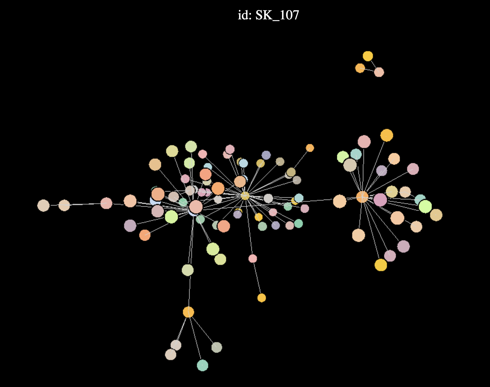

```{r global_options, include=FALSE}
knitr::opts_chunk$set(eval = FALSE, warning=FALSE, message=FALSE)
```

# Introduction

In order to study, prepare for, and intervene against disease outbreaks, infectious disease modellers and public health professionals need an extensive data analysis toolbox. Disease outbreak analytics involve a wide range of tasks that need to be linked together, from data collection and curation to exploratory analyses, and more advanced modelling techniques used for incidence forecasting[@funk:2016][@nouvellet:2017] or to predict the impact of specific interventions[@nouvellet:2015][@parker:2015]. Recent outbreak responses suggest that for such analyses to be as informative as possible, they need to rely on a wealth of available data, including timing of symptoms, characterisation of key delay distributions (e.g. incubation period, serial interval), and data on contacts between patients[@cauchemez:2014][@aylward:2014][@agua-agum:2015][@cori:2017]. 

The latter type of data is particularly important for outbreak analysis, not only because contacts between patients are useful for unravelling the drivers of an epidemic [@agua-agum:2016][@cauchemez:2016], but also because identifying new cases early can reduce ongoing transmission via contact tracing, i.e. follow-up of individuals who reported contacts with known cases[@senga:2017][@saurabh:2017]. However, curating contact data and linking them to existing line lists of cases is often challenging, and tools for storing, handling, and visualising contact data are often missing [@who:2009][@rakesh:2014].

Here, we introduce `epicontacts`, an R[@rcore] package providing a suite of tools aimed at merging line lists and contact data, and providing basic functionality for handling, visualising and analysing epidemiological contact data. Maintained as part of the R Epidemics Consortium (RECON http://www.repidemicsconsortium.org/), the package is integrated into an ecosystem of tools for outbreak response using the R language.

# Methods

## Operation

`epicontacts` is released as an open-source R package. A stable release is available for Windows, Mac and Linux operating systems via the CRAN repository. The latest development version of the package is available through the RECON Github organization.

```{r}
# install from CRAN
install.packages("epicontacts")

# install from Github
install.packages("devtools")
devtools::install_github("reconhub/epicontacts")
```

```{r, eval = TRUE}
# load and attach the package
library(epicontacts)
```

## Implementation

### Data handling

`epicontacts` includes a novel data structure to accommodate line list and contact list datasets in a single object. This object is constructed with the `make_epiconctacts()` function and includes attributes from the original datasets. Once combined, these are mapped internally in a graph paradigm as nodes and edges. The `epicontacts` data structure also includes a `logical` attribute for whether or not this resulting network is directed.

The package takes advantage of R's generic functions, which call specific methods depending on the class of an object. This is implemented several places, including the `summary.epicontacts()` and `print.epicontacts()` methods, both of which are respectively called when the `summary()` or `print()` functions are used on an `epicontacts` object. The package does not include built-in data, as exemplary contact and line list datasets are available in the `outbreaks` package[@outbreaks].

```{r}
# install the outbreaks package for data
install.packages("outbreaks")
```

```{r, eval = TRUE}
# load the outbreaks package
library(outbreaks)

# construct an epicontacts object
x <- make_epicontacts(linelist=mers_korea_2015[[1]],
                      contacts = mers_korea_2015[[2]],
                      directed=TRUE)

# print the object   
x               
    
# view a summary of the object                  
summary(x)
```

### Data visualisation

`epicontacts` implements two interactive network visualisation packages: `visNetwork` and `threejs`[@visNetwork][@threejs]. These frameworks provide R interfaces to  the `vis.js` and `three.js` JavaScript libraries respectively. Their functionality is incorporated in the generic `plot()` method (Figure 1) for an `epicontacts` object, which can be toggled between either with the "type" parameter. Alternatively, the `visNetwork` interactivity is accessible via `vis_epicontacts()` (Figure 2), and `threejs` through `graph3D()` (Figure 3). Each function has a series of arguments that can also be passed through `plot()`. Both share a color palette, and users can specify node, edge and background colors. However, `vis_epicontacts()` includes a specification for "node_shape" by a line list attribute as well as a customization of that shape with an icon from the Font Awesome icon library. The principal distinction between the two is that `graph3D()` is a three-dimensional visualisation, allowing users to rotate clusters of nodes to better inspect their relationships.

```{r}
plot(x)
```

{width=100%}

```{r}
vis_epicontacts(x,
                node_shape = "sex",
                shapes = c(F = "female", M = "male"),
                edge_label = "exposure")
```

{width=100%}

```{r}
graph3D(x, bg_col = "black")
```

{width=100%}

### Data analysis
  
Subsetting is a typical preliminary step in data analysis. `epicontacts` leverages a customized `subset` method to filter line list or contacts based on values of particular attributes from nodes, edges or both. If users are interested in returning only contacts that appear in the line list (or vice versa), the `thin()` function implements such logic.

```{r}
# subset for males
subset(x, node_attribute = list("sex" = "M"))

# subset for exposure in emergency room
subset(x, edge_attribute = list("exposure" = "Emergency room"))

# subset for males who survived and were exposed in emergency room
subset(x,
       node_attribute = list("sex" = "M", "outcome" = "Alive"),
       edge_attribute = list("exposure" = "Emergency room"))

thin(x, "contacts")
thin(x, "linelist")  
```

For analysis of pairwise contact between individuals, the `get_pairwise()` feature searches the line list based on the specified attribute. If the given column is a numeric or date object, the function will return a vector containing the difference of the values of the corresponding "from" and "to" contacts. This can be particularly useful, for example, if the line list includes the date of onset of each case. The subtracted value of the contacts would approximate the serial interval for the outbreak[@fine:2003]. For factors, character vectors and other non-numeric attributes, the default behavior is to print the associated line list attribute for each pair of contacts. The function includes a further parameter to pass an arbitrary function to process the specified attributes. In the case of a character vector, this can be helpful for tabulating information about different contact pairings with `table()`.

```{r}
# find interval between date onset in cases
get_pairwise(x, "dt_onset")

# find pairs of age category contacts
get_pairwise(x, "age_class")

# tabulate the pairs of age category contacts
get_pairwise(x, "age_class", f = table)
```

# Use Cases

Those interested in using `epicontacts` should have a line list of cases as well as a record of contacts between individuals. Both datasets must be enumerated in tabular format with rows and columns. At minimum the line list requires one column with a unique identifier for every case. The contact list needs two columns for the source and destination of each pair of contacts. The datasets can include arbitrary features of case or contact beyond these columns. Once loaded into R and stored as `data.frame` objects, these datasets can be passed to the `make_epicontacts()` function (see 'Methods' section for more detail). For an example of data prepared in this format, users can refer to the `outbreaks` R package.

```{r, eval = TRUE}
# load the outbreaks package
library(outbreaks)

# example simulated ebola data

# line list
str(ebola_sim$linelist)
# contact list
str(ebola_sim$contacts)

# example middle east respiratory syndrome data

# line list
str(mers_korea_2015$linelist)
# contact list
str(mers_korea_2015$contacts)
```

# Discussion

## Benefits

While there are software packages available for epidemiological contact visualisation and analysis, none aim to accommodate line list and contact data as purposively as `epicontacts`[@noremark:2014][@carroll:2014][@guthrie:2017]. Furthermore, this package strives to solve a problem of plotting dense graphs by implementing interactive network visualisation tools. A static plot of a network with many nodes and edges may be difficult to interpret. However, by rotating or hovering over an `epicontacts` visualisation, a user may better understand the data.

## Future considerations

The maintainers of `epicontacts` anticipate new features and functionality. Future development could involve performance optimization for visualising large networks, as generating these interactive plots is resource intensive. Additionally, attention may be directed towards inclusion of alternative visualisation methods.  

# Conclusions 

`epicontacts` provides a unified interface for processing, visualising and analyzing disease outbreak data in the R language. The package and its source are freely available on CRAN and Github. By developing functionality with line list and contact list data in mind, the authors aim to enable more efficient epidemiological outbreak analyses.

# Software availability

1. URL link to where the software can be downloaded from or used by a non-coder: https://CRAN.R-project.org/package=epicontacts
2. URL link to the author's version control system repository containing the source code: https://github.com/reconhub/epicontacts
3. Link to source code as at time of publication (*F1000Research* TO GENERATE)
4. Link to archived source code as at time of publication (*F1000Research* TO GENERATE)
5. Software license: GPL 2

# Author contributions

- VPN: Conceptualization, Software, Writing - Original Draft Preparation
- NR: Conceptualization, Software, Writing - Original Draft Preparation
- FC: Conceptualization, Software, Writing - Original Draft Preparation
- TC: Conceptualization, Software
- TJ: Conceptualization, Software, Writing - Original Draft Preparation

# Competing interests

No competing interests were disclosed.

# Grant information

The authors declared that no grants were involved in supporting this work.

# Acknowledgements

The authors would like to thank all of the organizers and participants of the Hackout3 event held in Berkeley, California June 20-24, 2016. In particular, the authors acknowledge the support of the following organizations: MRC Centre for Outbreak Analysis, and Modelling at Imperial College London, the NIHR’s Modelling Methodology Health Protection Research Unit at Imperial College London, and the Berkeley Institute for Data Science. 